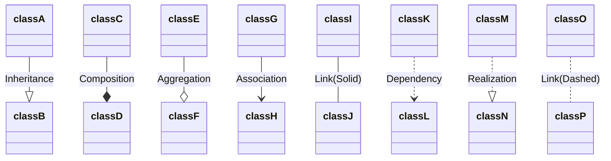

# Hello

$$
\begin{align}
2x^2 + 3(x-1)(x-2) & = 2x^2 + 3(x^2-3x+2)\\ \nonumber &= 2x^2 + 3x^2 - 9x + 6\\ &= 5x^2 - 9x + 6
\end{align}
$$

Here is a simple flow chart:

First Header  | Second Header
------------- | -------------
Content Cell  | Content Cell
Content Cell  | Content Cell

